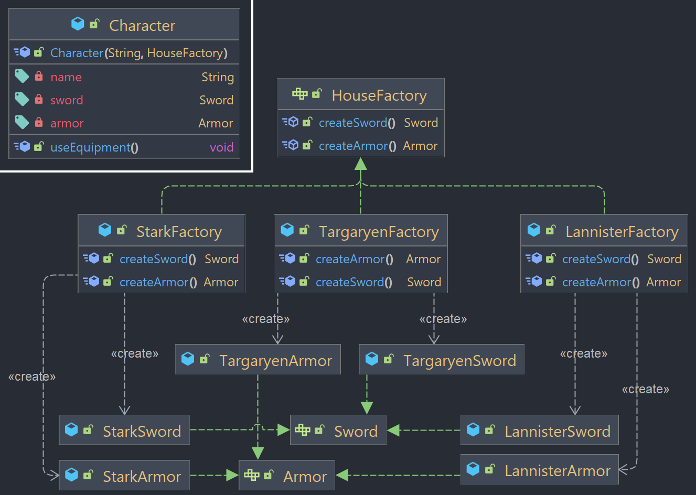

## Abstract Factory

Design pattern criacional que permite produzir famílias de objetos relacionados sem especificar suas classes concretas.

### Exemplo



O exemplo utilizado vem de "Game of Thrones", com as casas Targaryen, Stark e Lannister. Para cada casa, existe uma espada e uma armadura específica, assim existindo uma "fábrica" para cada casa.

```HouseFactory``` é a interface **abstract factory** que define os métodos de criação de objetos relacionados, neste caso, espadas e armaduras (_Weapon_ e _Armor_) para cada casa.

As classes _StarkFactory_, _LannisterFactory_ e _TargaryenFactory_ são implementações concretas da interface HouseFactory que criam objetos relacionados de acordo com a casa.

As classes concretas _StarkWeapon, StarkArmor, LannisterWeapon, LannisterArmor, TargaryenWeapon e TargaryenArmor_ implementam as interfaces de equipamentos correspondentes.

A classe ```Character``` é o cliente que utiliza os produtos da Abstract Factory (HouseFactory). O atributo houseFactory pode ser definido como qualquer implementação de HouseFactory e os atributos _sword_ e _armor_ são criados a partir de qual implementação de houseFactory o personagem possui. 
Assim, um personagem com a starkFactory teria uma StarkSword e uma StarkArmor, por exemplo.

O método ```useEquipment()``` mostra na saída o nome do personagem e os equipamentos que ele está usando.

### Demonstração

```java
HouseFactory starkFactory = new StarkFactory();
Character nedStark = new Character("Ned Stark", starkFactory);
nedStark.useEquipment(); // Ned Stark uses Valyrian steel sword 'Ice' and Stark leather and metal armor

HouseFactory lannisterFactory = new LannisterFactory();
Character jaimeLannister = new Character("Jaime Lannister", lannisterFactory);
jaimeLannister.useEquipment(); // Jaime Lannister uses Valyrian steel sword 'Brightroar' and Lannister gold-plated armor

HouseFactory targaryenFactory = new TargaryenFactory();
Character aegonTargaryen = new Character("Aegon Targaryen", targaryenFactory);
aegonTargaryen.useEquipment(); // Aegon Targaryen uses Valyrian steel sword 'Blackfyre' and Targaryen dragon scale armor
```

O código acima cria instâncias das implementações StarkFactory, LannisterFactory e TargaryenFactory, e cria 3 personagens, com seus respectivos nomes e cada um recebendo a factory de sua casa. O método useEquipment() é chamado para mostrar os equipamentos utilizados por cada personagem.

Dessa forma, o padrão Abstract Factory possibilita criar a família de objetos relacionados, nesse caso equipamentos que são da mesma casa. Assim, a criação de novos personagens pode ser feita de forma mais flexível e modular, permitindo que novas casas sejam facilmente adicionadas, sem precisar alterar o código original.