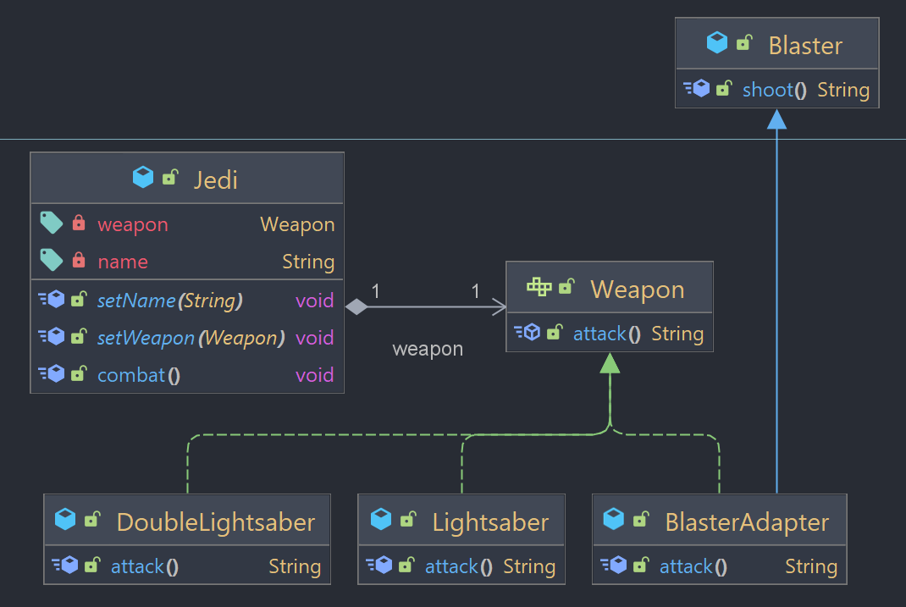

## Adapter

Design pattern estrutural que permite que objetos com interfaces incompatíveis colaborarem entre si. Ele adapta uma classe existente para uma interface esperada, sem alterar a interface original.

### Exemplo



O exemplo utilizado vem de "Star Wars", em que um Jedi pode utilizar várias armas, nesse caso um sabre de luz, um sabre de luz com duas lâminas e uma blaster (arma de longo alcance).

A interface ```Weapon``` define o comportamento esperado para qualquer arma, com o método ```attack()```. 
As classes _Lightsaber_ e _DoubleLighsaber_ são implementações concretas da interface Weapon.

A classe ```Jedi``` é o cliente que utiliza a interface Weapon. Ela tem um atributo _weapon_ que pode ser definido como qualquer implementação de Weapon. O método ```combat()``` chama o método _attack()_ da instância de Weapon.

A classe ```Blaster``` é uma classe de fora da aplicação que não implementa a interface Weapon. Sendo externa, ela não pode ser adaptada ou modificada, sendo adicionada como biblioteca.

Para que a classe Jedi possa usá-la, é necessário criar um **adaptador** que adapte a classe _Blaster_ à interface Weapon. Assim é criada a classe ```BlasterAdapter```, que herda da classe Blaster (externa) e implementa a interface Weapon.

BlasterAdapter age como um adaptador entre a classe Blaster e a interface Weapon, permitindo que objetos do tipo Blaster sejam utilizados em contextos que esperam um objeto do tipo Weapon. 

Para fazer isso, o BlasterAdapter implementa o método _attack()_ da interface Weapon e chama o método ```shoot()``` da classe Blaster. Dessa forma, a classe Blaster é adaptada para a interface Weapon sem a necessidade de qualquer alteração nos códigos.

### Demonstração

```java
Jedi obiWan = new Jedi("Obi-Wan");

obiWan.setWeapon(new Lightsaber());
obiWan.combat(); // Obi-Wan attacks with the lightsaber

obiWan.setWeapon(new DoubleLightsaber());
obiWan.combat(); // Obi-Wan attacks with the double-bladed lightsaber

obiWan.setWeapon(new BlasterAdapter());
obiWan.combat(); // Obi-Wan shoots with the blaster
```

O código acima cria uma instância da classe Jedi chamada "Obi-Wan", com a habilidade de utilizar a arma Lightsaber.
Após isso, o método setWeapon() é utilizado para mudar a arma de Obi-Wan para DoubleLightsaber e para Blaster (através do adaptador BlasterAdapter).

Dessa forma, o padrão Adapter possibilita que o objeto Jedi utilize este novo tipo de arma, sem a necessidade de alterar seu código original. O mesmo aconteceria para novos tipos de arma que não implementem Weapon, bastando criar um adaptador, e assim permitindo uma maior flexibilidade e reutilização de código.

**Observação:** Para executar este exemplo, também é necessário adicionar `BlasterLib.jar` como uma biblioteca no projeto. 