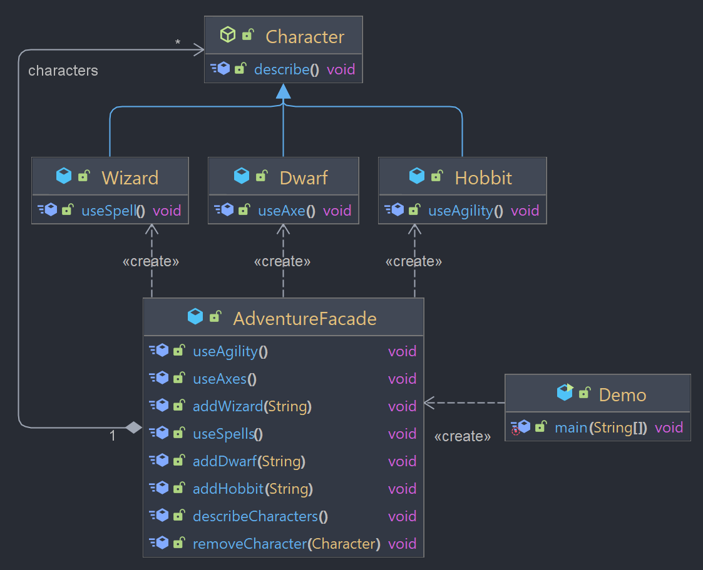

## Facade

Design pattern estrutural que fornece uma interface simplificada para um subsistema complexo, tornando-o mais fácil de usar. Ele envolve um conjunto de interfaces mais complexas em uma interface mais simples, reduzindo a complexidade do código do cliente.

### Exemplo



O exemplo utilizado vem de "O Hobbit".

A classe abstrata `Character` define o comportamento básico dos personagens, com o método _describe()_ que imprime uma descrição.

As classes _Wizard_, _Dwarf_ e _Hobbit_ são subclasses de Character, que sobrescrevem o método `describe()` e definem funções específicas para cada tipo de personagem. Por exemplo, a classe Hobbit cria a descrição citando que o personagem é um Hobbit que está na aventura, e também define a função useAgility(), específica de um Hobbit. O mesmo ocorre para as outras subclasses.

As subclasses de personagens representam um subsistema complexo que possui funcionalidades distintas, tornando a sua utilização pouco intuitiva para o cliente do sistema.

A classe `AdventureFacade` é a fachada que encapsula esse subsistema e provê uma interface simplificada para sua utilização. Ela possui uma lista de personagens e define o método _addHobbit()_, por exemplo, que cria e adiciona uma instância de Hobbit para a lista e o método _useAgility()_, que percorre essa lista e faz com que cada Hobbit use sua função própria useAgility(), que é específica de Hobbit. O mesmo para as classes Wizard e Dwarf é feito na fachada. 

Assim, na classe Demo, é criada apenas uma instância da classe AdventureFacade, e é através dessa instância que são utilizados os métodos de adicionar personagens à aventura e utilizar suas habilidades específicas, em vez de precisar lidar com cada classe de personagem individualmente.

### Demonstração

```java
AdventureFacade adventureFacade = new AdventureFacade();

adventureFacade.addDwarf("Thorin");
adventureFacade.addHobbit("Bilbo");
adventureFacade.addWizard("Gandalf");

adventureFacade.describeCharacters(); 
// The Dwarf Thorin is in the adventure!
// The Hobbit Bilbo is in the adventure!
// The Wizard Gandalf is in the adventure!

adventureFacade.useAxes();  // Thorin uses their axe to chop through obstacles
adventureFacade.useAgility();  // Bilbo uses their agility and size to infiltrate or go unnoticed
adventureFacade.useSpells(); // Gandalf casts a powerful spell

```

O código acima cria uma lista usando a classe AdventureFacade, que funciona como uma fachada para a criação dos personagens. São adicionados um Dwarf, um Hobbit e um Wizard à lista, utilizando os métodos addDwarf(), addHobbit() e addWizard() da fachada. Em seguida, o método describeCharacters() é chamado, percorrendo a lista e imprimindo uma descrição de cada personagem.  

Depois, são chamados os métodos useAxes(), useAgility() e useSpells(), que percorrem a lista novamente e, se encontrar um personagem do tipo Dwarf, por exemplo (no caso do método useAxes), executa a habilidade específica de usar um machado para cada um. O mesmo para os outros métodos. 

Dessa forma, o padrão Facade é utilizado com a fachada AdventureFacade para simplificar a criação e utilização dos personagens e suas habilidades. Assim, o cliente não precisa saber detalhes de como os personagens são criados ou como suas habilidades são implementadas, ele não precisa interagir diretamente com as classes, bastando chamar os métodos adequados na fachada.

Isso torna o código mais simples, modular e flexível, pois caso seja necessário adicionar novos tipos de personagens ou habilidades, isso pode ser feito sem afetar o código do cliente, apenas adaptando a fachada para incluir o desejado. Além disso, o padrão Facade também facilita a manutenção do código, já que as alterações são restritas a um único ponto de acesso.