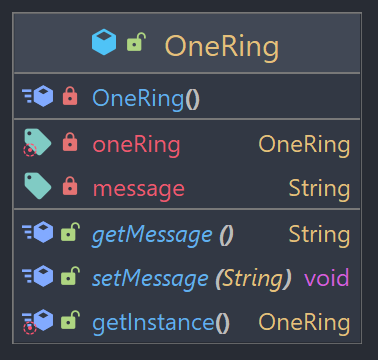

## Singleton

Design pattern criacional que garante que uma classe tenha apenas uma instância e oferece um ponto global de acesso a essa instância.

### Exemplo



O exemplo utilizado vem de "O Senhor dos Anéis", em que a classe OneRing representa o Um Anel.

A classe ```OneRing``` é a implementação do padrão **singleton**. Ela tem um atributo de classe oneRing que é uma instância única da classe. O método estático ```getInstance()``` é responsável por criar ou retornar a única instância existente de OneRing. 

### Demonstração

```java
OneRing oneRing = OneRing.getInstance();
System.out.println(oneRing.getMessage()); // One Ring to rule them all

OneRing anotherOneRing = OneRing.getInstance();
anotherOneRing.setMessage("One Ring to find them");
System.out.println(anotherOneRing.getMessage()); // One Ring to find them

System.out.println(oneRing.getMessage()); // One Ring to find them
System.out.println(anotherOneRing.getMessage()); // One Ring to find them

System.out.println(oneRing == anotherOneRing); // true
```

O código de exemplo acima cria uma instância da classe OneRing chamada oneRing usando o método _getInstance()_, e imprime a mensagem padrão do Um Anel. Em seguida, ele cria outra instância chamada anotherOneRing usando o mesmo método, e altera a mensagem dela para "One Ring to find them". 

Como a classe OneRing é um Singleton, anotherOneRing é uma referência para a mesma instância que oneRing. Portanto, ao alterar o valor da mensagem através de anotherOneRing, na verdade é alterada a mensagem na mesma instância única de OneRing. 

Por essa razão, ao imprimir as mensagens, elas tem o mesmo resultado. Além disso, como as duas variáveis se referem à mesma instância, ao compará-las com o operador ==, mostrando true.