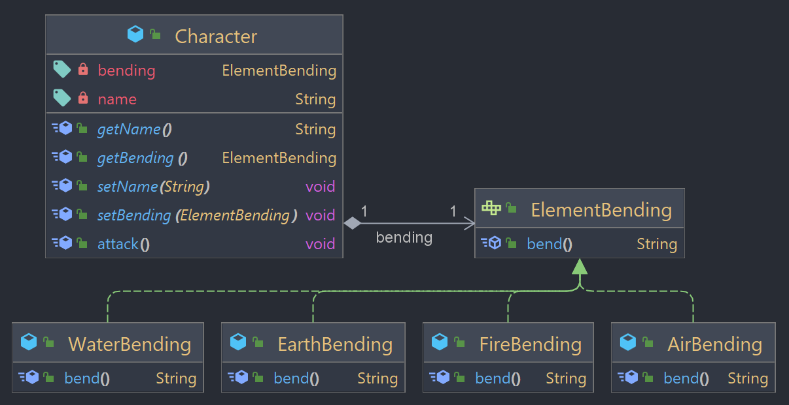

## Strategy

Design pattern comportamental que permite definir diferentes opções de implementação de um mesmo comportamento, separando cada opção específica em classes separadas e intercambiáveis, ou seja, uma pode ser usada no lugar da outra. Assim um objeto que possua esse comportamento pode usar diferentes opções dele sem mudar seu próprio código. 

### Exemplo



O exemplo utilizado vem de "Avatar: A lenda de Aang".

```ElementBending``` é a interface **strategy** que define o método _bend()_ para cada elemento. 

As classes _FireBending_, _WaterBending_, _EarthBending_ e _AirBending_ são implementações concretas da interface ElementBending para cada tipo de elemento.

A classe ```Character``` é o contexto que utiliza a estratégia ElementBending. Ele tem um atributo _bending_ que pode ser definido como qualquer implementação de ElementBending. O método _attack()_ chama o método bend() da instância de ElementBending.

```java
Character aang = new Character("Aang", new AirBending());
aang.attack(); // Aang uses airbending

aang.setBending(new WaterBending());
aang.attack(); // Aang uses waterbending

aang.setBending(new EarthBending());
aang.attack(); // Aang uses earthbending

aang.setBending(new FireBending());
aang.attack(); // Aang uses firebending
```