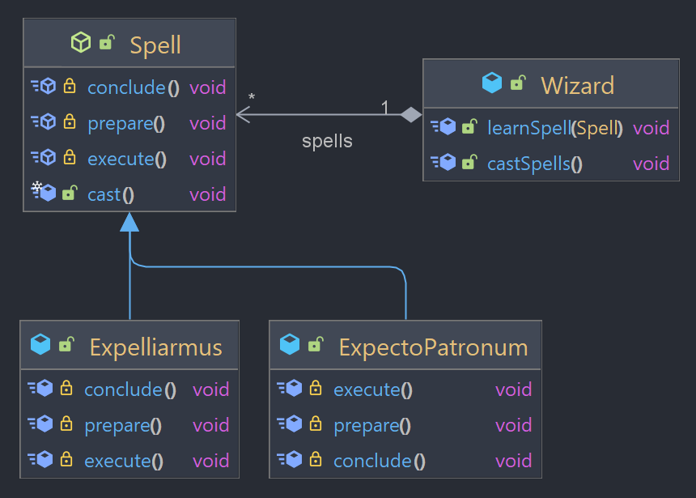

## Template Method

Design pattern comportamental que define a estrutura básica de um algoritmo na superclasse e permite que as subclasses implementem etapas específicas desse algoritmo sem alterar sua estrutura.

### Exemplo



O exemplo utilizado vem de "Harry Potter", em que um bruxo (Wizard) pode aprender diferentes feitiços  (Spell). Cada feitiço possui uma ordem específica de execução que é determinada pela superclasse abstrata Spell, que implementa o padrão Template Method.

A classe `Spell` é uma classe abstrata que define o método `cast()` como um **método template**, que implementa a sequência de etapas comuns para todos os feitiços: preparação da varinha, execução do feitiço e conclusão do feitiço, chamando os métodos _prepare()_, _execute()_ e _conclude()_.

Esses 3 métodos são específicos para cada feitiço, assim são implementados pelas classes filhas `ExpectoPatronum` e `Expelliarmus`. Por exemplo, na classe _ExpectoPatronum_, o método _prepare()_ se concentra em pensamentos felizes, já na classe _Expelliarmus_, o método _prepare()_ visa apontar a varinha do oponente. O mesmo ocorre para os métodos seguintes, cada um de acordo com sua classe de feitiço. 

O método _cast()_ não pode ser sobrescrito pelas subclasses (declarado como final), garantindo que a sequência de execução não seja alterada e que a lógica de execução dos feitiços siga um padrão predefinido. Isso garante que os feitiços sejam executados corretamente, independentemente da implementação específica de cada feitiço. 

A classe `Wizard` representa um bruxo que pode aprender diferentes feitiços através do método `learnSpell()`. O método `castSpells()` itera sobre a lista de feitiços aprendidos e chama o método _cast()_ para cada feitiço.


### Demonstração

```java
Wizard luna = new Wizard("Luna Lovegood");

luna.learnSpell(new Expelliarmus());
luna.learnSpell(new ExpectoPatronum("Hare"));

luna.castSpells();
// Luna Lovegood is casting a spell:
// Preparing the wand and pointing it at the opponent's wand
// Expelliarmus! The opponent's wand is knocked out of their hand
// Incantation complete! End of duel

// Luna Lovegood is casting a spell:
// Preparing the wand and concentrating on happy memories
// Expecto Patronum! Hare patronus appears
// Incantation complete! Patronus fades away
```

O código acima cria uma instância da classe Wizard chamada "Luna Lovegood", que aprende dois feitiços diferentes: Expelliarmus e Expecto Patronum. A instância de Expelliarmus é criada sem parâmetros, enquanto a instância de ExpectoPatronum é criada com o parâmetro "Hare" (Lebre), que representa o animal que será invocado pelo feitiço.

Em seguida, o método castSpells() é chamado, que invoca o método cast() para cada feitiço aprendido por Luna. Como resultado, os dois feitiços são lançados com a sequência correta de preparação, execução e conclusão.

O padrão Template Method ajuda a evitar a duplicação de código ao permitir que diferentes feitiços compartilhem uma estrutura comum de execução, além de garantir a consistência na ordem de execução dos métodos, implementados nas subclasses relacionadas. Também permite que novos feitiços sejam adicionados sem alterar a estrutura existente, tornando o código mais extensível e fácil de manter.